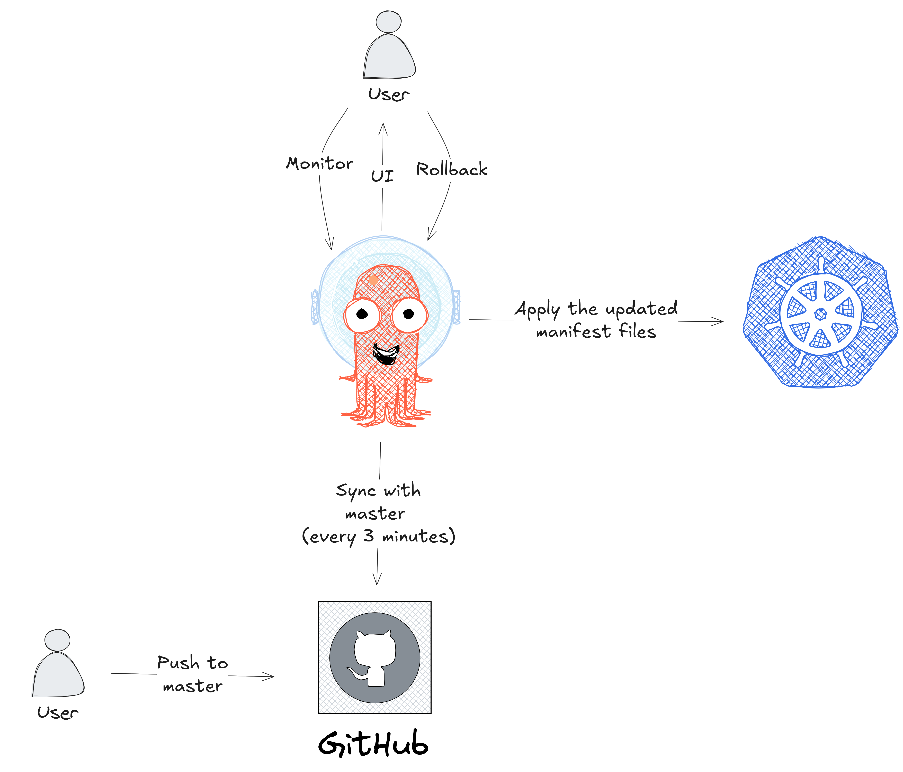
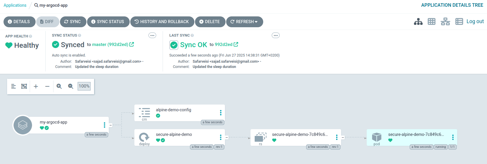
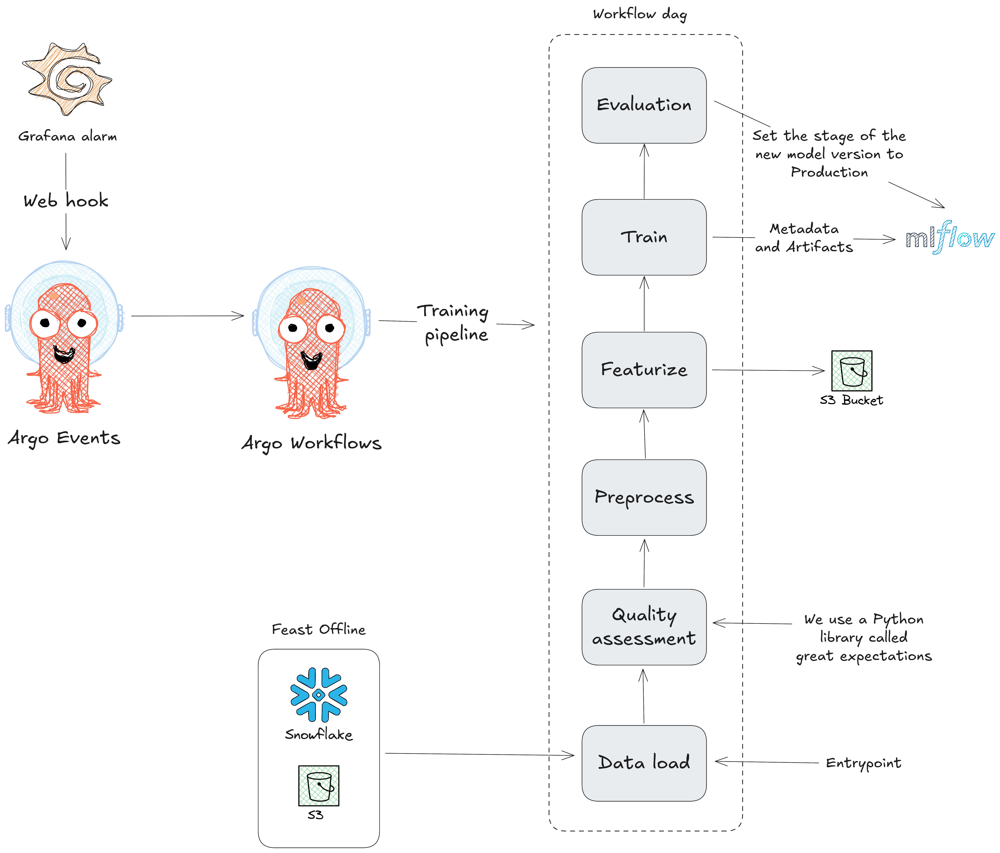

## CI/CD Pipeline using GitHub Actions and Argo CD

#### Workflow


#### Continuous Delivery

To deploy an Argo CD application, apply the associated manifest file to your Kubernetes cluster:

```bash
kubectl apply -f argocd-application.yml
```

To access the Argo CD API server, you first need to change the `argocd-server` service type to `LoadBalancer`:

```bash
kubectl patch svc argocd-server -n argocd -p '{"spec": {"type": "LoadBalancer"}}'
```

Use the external ip of the load balander to access the UI.

Argo CD continuously monitors the `master` branch and automatically updates the Kubernetes deployments based on the manifest files located in the `manifests-argocd` directory.

##### Successful deployment


#### Continuous Integration

Continuous integration is handled via GitHub Actions. The typical workflow is as follows:

1. Create a new branch.
2. Modify the necessary files.
3. Update the version in `pyproject.toml` (`version = "x.x.x"`).
4. Commit and push the changes to the remote repository.
5. Open a pull request (PR) to merge the changes into the `master` branch.

## Extra Material

### Argo Events and Workflows

Think of this section as the “cherry on top” of the repository: a focused exploration of how [Argo Events](https://argoproj.github.io/argo-events/) integrate with [Argo Workflows](https://argoproj.github.io/workflows/). The following diagram walks through a representative use case.



Please also see `/demo-argo-events/demo-event-sensor-1.yml` for a minimal running example for an Argo event. In summary:

1. Event Arrival: A webhook event (see `/demo-argo-events/job-send-webhook.yml`) hits the EventSource; Sensor dependency `test-dep` is satisfied.

2. Parameter Extraction: Sensor reads `body.message` and `body.ttl` from the event payload.

3. Workflow creation (`generateName: webhook‑`) with a DAG entrypoint named `print`.

| Order | Task (template)                            | Action                                                                                                                                                                                            |
| ----- | ------------------------------------------ | ------------------------------------------------------------------------------------------------------------------------------------------------------------------------------------------------- |
| 1     | **`print-body-message`** (`print-message`) | Alpine container echoes the `message`.                                                                                                                                                            |
| 2     | **`print-body-ttl`** (`print-ttl`)         | Echoes the `ttl`. *Depends on 1*                                                                                                                                                                  |
| 3     | **`print-body-all`** (`print-both`)        | Python script prints both params + conditional “hook” check. *Depends on 1 & 2*                                                                                                                   |
| 4     | **`clone-my-repo`** (`clone-repo`)         | Clones GitHub repo `airflow-stackable` (branch `master`) into `/tmp`, then uploads **`/tmp/pyproject.toml`** to S3 (`customerintelligence/argo/repo/<repo>/pyproject.toml`). *Depends on 1, 2, 3* |
| 5     | **`print-poetry-file`** (`print-poetry`)   | Downloads the `pyproject.toml` artifact from S3 and `cat`s its contents. *Depends on 4*                                                                                                           |

Key Details

* Artifact passing: `clone-repo` writes *pyproject.toml* as an output artifact; print-poetry-file receives it via `from: "{{tasks.clone-my-repo.outputs.artifacts.poetry-file}}"`.
* S3 credentials: Access/secret keys are injected from the `s3-credentials` Secret.
* Service Account: All workflow pods run under `operate-workflow-sa`.
* DAG vs. Steps: Parallelism is controlled via explicit `dependencies`, giving a clear linear flow (1 → 2 → 3 → 4 → 5).

You can use the `argo cli` to see the status of the workflow:

```bash
argo get @latest -n argo-events
```

<details>
<summary><strong>Click to expand raw CLI output</strong></summary>

```text
Name:                webhook-54cgn
Namespace:           argo-events
ServiceAccount:      unset (will run with the default ServiceAccount)
Status:              Succeeded
Conditions:
 PodRunning          False
 Completed           True
Created:             Thu Jul 31 14:28:57 +0200 (1 minute ago)
Started:             Thu Jul 31 14:28:57 +0200 (1 minute ago)
Finished:            Thu Jul 31 14:29:47 +0200 (34 seconds ago)
Duration:            50 seconds
Progress:            5/5
ResourcesDuration:   0s*(1 cpu),20s*(100Mi memory)
Parameters:
  message:           this is my first webhook
  ttl:               60s

STEP                     TEMPLATE       PODNAME                                 DURATION  MESSAGE
 ✔ webhook-54cgn         print
 ├─✔ print-body-message  print-message  webhook-54cgn-print-message-3981391966  5s
 ├─✔ print-body-ttl      print-ttl      webhook-54cgn-print-ttl-1626059273      5s
 ├─✔ print-body-all      print-both     webhook-54cgn-print-both-1421658730     5s
 ├─✔ clone-my-repo       clone-repo     webhook-54cgn-clone-repo-2196798971     7s
 └─✔ print-poetry-file   print-poetry   webhook-54cgn-print-poetry-693254238    6s
```

</details>


**This example has nothing to do with the graph shown above.**

You can also see some demos for Argo workflows in `/demo-argo-workflows` with some of them taken directly from the git repository for the [Argo workflows](https://github.com/argoproj/argo-workflows/tree/main/examples).
